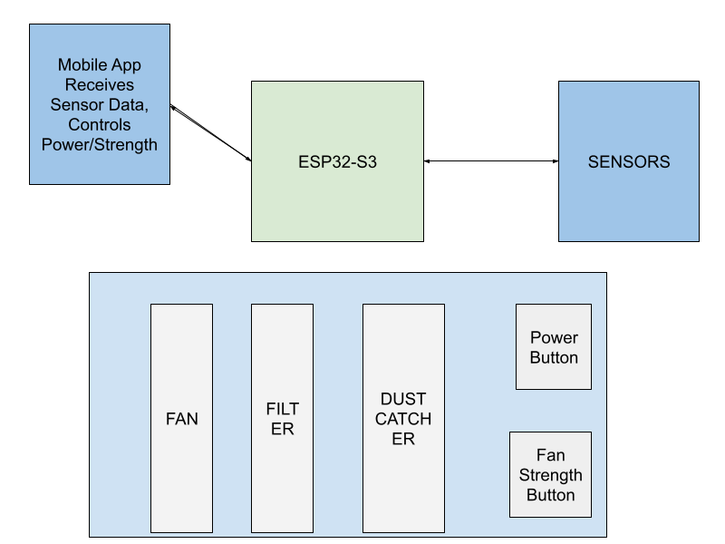

# Checklist

- [ ] **Personas**
  - **David (Hobbyist):**
    - *Profile* - 30 years old, maintains a maker space for his DIY projects. Wants to have a convenient way to be safe as he completes projects.

  - **Rachel (Teacher):**
    - *Profile* - STEM teacher on a limited budget who cannot afford top of the line commercial air purification.

  - **Ben (Grad Student):**
    - Profile: Needs to have an exact measurement of the air quality for his project 

- [ ] **Need Statement**
    - General air purifiers need to be managed in-person and are unable to report on current air quality statistics.
      

- [ ] **Goal Statement**
    - Create an energy-efficient autonomous smart air purifier that isn’t reliant on manual control

- [ ] **Design Objective**
    - Objective: Design an efficient, autonomous smart air purifier that reports air quality statistics,can dynamically adjust filtration based on pollutant levels (Particle Matter), and is cost effective to manufacture and maintain for hobbyists and classrooms.

      | Design Objective | Units | Target / Range |
      | :--- | :--- | :--- |
      | Manufacturing Cost | USD ($) | $60 - $100 |
      | Target Air Quality (PM) | AQI | < 50 |
      | Noise Level | Decibels (dB) | 35 - 50 |
      | Filter Replacement Time | Minutes | < 1 |
      | Filter Lifespan | Hours | 2000 - 8000 |
- [ ] **Conceptualisations**
    -
- [ ] **Decision Table**

    - **Remote Access Architecture**
      
      | Option | Practicality / Accessibility | Security Risk | Setup Requirements |
      | :--- | :--- | :--- | :--- |
      | **Cloud Relay** | Most practical; allows access anywhere with internet | Low (handled by cloud provider) | Requires internet connection and setting up a cloud account |
      | **Port Forwarding / Dynamic DNS** | Simple concept | High (exposes the RPi4 API to the public internet) | Depends heavily on specific router configurations |

    - **Cloud Service Provider**
      
      | Cloud Service | Database & History Queries | IoT/Hardware Support | App Integration & Ease of Use | Cost & Limits |
      | :--- | :--- | :--- | :--- | :--- |
      | **Firebase (Google)** | Limited query capabilities for time-series data; NoSQL can get unwieldy | No custom server code needed; RPi4 pushes via REST API | Mature React Native SDK; instantly pushes updates without polling | Generous free tier, but pricing spikes with frequent writes |
      | **AWS IoT Core** | Pipes data into databases like DynamoDB, S3, or Lambda | Purpose-built for IoT; native MQTT support, device shadows, rules engine | Steep learning curve; requires more glue code for the mobile app | Free tier limited to 250k messages/month for 12 months |
      | **MQTT Broker (HiveMQ)** | Does not inherently store data; separate database needed for history | Standard IoT protocol (lightweight, low-bandwidth) | Requires less common MQTT client library for mobile app | Varies; Adafruit IO free tier is limited, HiveMQ allows 10GB/month |
      | **Supabase** | Real Postgres database allows powerful SQL queries for historical data | Not specifically designed for IoT; no device management features | Auto-generates REST API; has realtime subscriptions for apps | 500MB database and 5GB bandwidth on the free tier |

    - **Fan & Filter Hardware Configuration**
      
      | Configuration Option | Airflow Expectation | Static Pressure | Uniformity |
      | :--- | :--- | :--- | :--- |
      | **Series: Intake → Fan → Filter → Fan → Exhaust** | Faster pollutant reduction | Generates higher static pressure to push/pull through restrictive filters | Balances both push and pull mechanics |
      | **Series: Intake → Fan → Fan → Filter → Exhaust** | Faster pollutant reduction | Generates higher static pressure (pushing power) | "Push" configurations generally provide less uniform airflow |
      | **Series: Intake → Filter → Fan → Fan → Exhaust** | Faster pollutant reduction | Generates higher static pressure (pulling power) | "Pull" configurations are expected to produce more uniform airflow |
      | **Parallel: Intake → Fan \| Fan → Filter → Exhaust**| Higher airflow in low-resistance conditions | Reduced effectiveness against dense, restrictive filters | Less uniform due to being a strictly "push" configuration |
      | **Parallel: Intake → Filter → Fan \| Fan → Exhaust**| Higher airflow in low-resistance conditions | Reduced effectiveness against dense, restrictive filters | More uniform due to being a strictly "pull" configuration |
- [ ] **Basic Plan - Gantt Chart**
    - https://docs.google.com/spreadsheets/d/1Ui5CqO9LXlo5OME9tFne_e-ai2fUoh3hpXCWUBuXLiE/edit?usp=sharing
- [ ] **Aesthetic & Functional Prototypes**
- [ ] **Design for Manufacture & Assembly**
- [ ] **Test Plan**
- [ ] **Test Report**
- [ ] **Life Cycle Assessment**
- [ ] **Ethics Statement**
